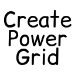

    

<h1 align="center">Create: Power Grid</h1>

Create: Power Grid is a mod that adds physics-based electricity simulation to the Create mod.

Just like in the main mod, everything is designed to encourage creativity while introducing new challenges and obstacles.
In the end you will be the proud owner of a world-wide power grid - one that <i>hopefully</i> doesn't collapse after you
flip that one unmarked switch...

Create's in-game 'Ponder' documentation will walk you through the basic physics behind the mod and help you get started
with concepts like Ohm's law.

